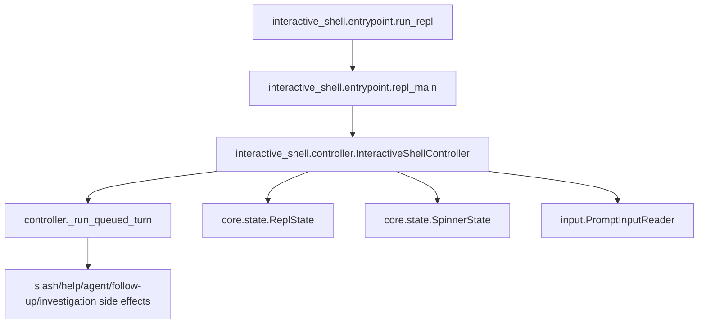

# Runtime package rules

## Human summary

The `runtime` package holds the focused support modules for the interactive
shell runtime. The top-level bootstrap and controller live one level up in
`interactive_shell/`.

In simple terms:

- `../entrypoint.py` starts the interactive session and handles startup/shutdown.
- `startup/first_launch_github.py` owns the first-launch GitHub sign-in gate.
- `../controller.py` owns the `InteractiveShellController` orchestration class,
  including prompt input, submitted prompt handling, queued turn consumption,
  prompt-mediated confirmation waits, one-turn pipeline handoff, background output draining, and
  shutdown.
- `core/prompt_manager.py` owns prompt-toolkit setup and prompt rendering.
- `input/` owns prompt input event conversion: EOF, Ctrl-C, CPR cleanup, and
  resume hints.
- `utils/input_policy.py` owns prompt stdin/spinner decisions for turns.
- `startup/initial_input.py` owns non-interactive initial-input replay.
- `background/workers.py` owns alert watching, spinner ticking, sampler startup,
  and turn-start background output drains.
- `background/` also owns background investigation records, launchers, and
  completion notification delivery.
- `core/` holds the core runtime engine:
  - `state.py` — shared runtime state (`ReplState`, `SpinnerState`)
  - `session.py` — per-REPL-process `ReplSession`
  - `token_accounting.py` — LLM token usage and run metadata
  - `turn_detection.py` — pure text classifiers for cancel, confirm, and correction detection
- `core/tasks.py` owns the cross-session task registry surfaced via `/tasks` and
  `/cancel`.

These instructions apply to `interactive_shell/runtime/` and all
subdirectories. Parent `AGENTS.md` files still apply.

## Architectural intent (locked)

The runtime package is intentionally split into focused concerns:

- `core/state.py` — runtime state and transition helpers only.
- `core/turn_detection.py` — pure prompt text classification only.
- `utils/input_policy.py` — terminal stdin/spinner gating decisions only.
- `../controller.py` — stable async entrypoint and async prompt runtime/event loop
  orchestration, submitted prompt handling, queued-turn consumption,
  prompt-mediated confirmation waits, turn telemetry, one-turn pipeline
  handoff, background output draining, and shutdown only.
- `core/prompt_manager.py` — prompt-toolkit setup and prompt rendering only.
- `input/` — prompt input event conversion and terminal-input cleanup only.
- `background/workers.py` — background worker startup and turn-start drain hooks
  only.
- `background/models.py` — background investigation record and preferences only.
- `background/runner.py` — session-local background investigation launchers only.
- `background/notifications.py` — background RCA completion notification delivery only.
- `../entrypoint.py` — process/bootstrap boundary only.
- `startup/initial_input.py` — scripted initial-input replay only.
- `startup/first_launch_github.py` — first-launch GitHub sign-in gate only.
- `core/session.py` — session-scoped REPL state only.
- `core/tasks.py` — task registry + persistence only.
- `core/token_accounting.py` — session-scoped LLM token accounting and run metadata only.

Keep these boundaries strict. If a change crosses concerns, move code to the
owner module instead of broadening module responsibilities.

## Data flow contract (locked)

The interactive runtime must keep this shape:

1. `interactive_shell.entrypoint.run_repl` sets up process-level concerns and calls `repl_main`.
2. `interactive_shell.entrypoint.repl_main` creates `InteractiveShellController`.
3. `InteractiveShellController.start_interactive_shell` owns prompt lifecycle,
   submitted input handling, queued-turn consumption, and per-turn task
   scheduling.
4. `InteractiveShellController._run_queued_turn` performs the one-turn shell pipeline handoff.

Do not invert this dependency direction.

### Architecture diagram

## State ownership rules

- `ReplState` is the single source of truth for:
  - active dispatch task
  - cancellation event
  - confirmation event/response lifecycle
  - exit requests
- Use `ReplState` helpers (`start_dispatch`, `finish_dispatch`,
  `begin_confirmation`, `clear_confirmation`, `cancel_current_dispatch`) rather
  than direct field mutation where possible.
- `SpinnerState` owns spinner rendering state only; it must not depend on
  runtime task management.

## Turn execution rules

- Do not reintroduce `dispatch.py` or any compatibility-only forwarding module.
- `InteractiveShellController._run_queued_turn` owns turn telemetry and the handoff into
  `handle_message_with_agent`.
- Put cancel/confirm/correction text classifiers in `core/turn_detection.py`.
- Put stdin blocking and spinner decisions in `utils/input_policy.py`.
- Keep prompt-mediated confirmation waiting in `controller.py`.

## Controller rules

- `../controller.py` owns:
  - `InteractiveShellController`
  - `start_interactive_shell` shell lifecycle orchestration
  - `_run_prompt_loop` — read and handle user input until exit
  - `_run_turn_queue_loop` — consume queued turns until exit
  - prompt input acceptance until exit
  - submitted prompt rendering and cancel/confirm/queue handling
  - queued turn consumption
  - per-turn task lifecycle
  - dispatch start/finish state transitions
  - prompt-mediated confirmation waiting
  - turn telemetry and `handle_message_with_agent` invocation
  - current turn cancellation helpers
  - coordination between prompt, background, and shutdown helpers
- `core/prompt_manager.py` owns:
  - prompt-toolkit wiring
  - prompt rendering callbacks
  - pending prompt defaults and autosubmit handling
- `input/` owns:
  - prompt input event types
  - terminal EOF and Ctrl-C conversion
  - CPR cleanup for submitted prompt text
  - session resume hints when prompt input closes
- `background/workers.py` owns:
  - alert watcher lifecycle
  - spinner ticker lifecycle
  - sampler startup
  - background notice drains at turn start
- Keep prompt rendering concerns in runtime/prompting modules, not in
  dispatch/execution.

## Entry-point rules

- `../entrypoint.py` owns:
  - startup sweep
  - TTY/non-TTY gate
  - banner display for interactive runs
  - alert listener setup/teardown
  - async boundary (`asyncio.run`)
- Do not move per-turn dispatch/runtime logic back into startup entrypoint.

## Compatibility surface policy

- `runtime/__init__.py` should be a thin export layer.
- Do not duplicate business logic in `__init__.py`.
- Do not re-add `_xxx` underscore aliases or wrapper functions for
  compatibility. Tests and callers should import canonical names from their
  owning submodule.

## Test seam policy

- Prefer patching canonical module seams:
  - `interactive_shell.controller.*` for prompt-loop, queued-turn, confirmation behavior,
    one-turn pipeline execution, and side effects
  - `interactive_shell.entrypoint.*` for process/bootstrap behavior
  - `runtime.core.state.*` for state-specific behavior
- Avoid adding new tests that monkeypatch package-root internals in
  `runtime.__init__` unless there is no stable canonical seam.

## Refactor guardrails

- No behavior changes to action-planning policy should be introduced from
  `runtime/` refactors.
- Keep interruption semantics unchanged:
  - Esc or bare cancel commands interrupt active dispatch
  - confirmation prompts are cancel-safe and never silently auto-confirm
- Preserve observability semantics (turn telemetry and turn summaries).
